ke

# Cli omprehensive Evaluation Report: AI Incident Triage Benchmark

**Rogers AI for Networks | NVIDIA NeMo Agent Toolkit & Frontier Model Evaluation**

> [!NOTE]
> This evaluation assesses whether an open-source model (**NVIDIA Nemotron-Super-49B Telco**) can automate telecom network incident triage with performance comparable to a commercial frontier model (**Foundry GPT-5.4**), considering accuracy, evidence grounding, and operational latency.

---

## 1. Executive Summary & Benchmark Matrix

Across 25 multi-domain incident test cases covering 5G EN-DC setup failures, fiber backhaul outages, cell barring changes, and RF sector interference:

* **GPT-5.4** delivered an **11.0% higher overall RCA accuracy** (48.0% vs. 37.0%) and **nearly 2x higher evidence precision (0.536 vs 0.276 F1 score)**.
* **GPT-5.4** operated **~6.7x faster** than Nemotron NIM at median latency ($p_{50}$: 7.7s vs. 52.0s) and **~17.8x faster** at tail latency ($p_{95}$: 11.8s vs. 210.6s).

| Evaluation Metric                              | **Foundry GPT-5.4** (Frontier) | **NVIDIA Nemotron Telco NIM** (Open-Source) | Delta / Operational Impact             |
| :--------------------------------------------- | :----------------------------------: | :-----------------------------------------------: | :------------------------------------- |
| **Root Cause Accuracy (RCA)**            |           **48.0%**           |                  **37.0%**                  | **+11.0% Higher Accuracy** 🟢    |
| **Evidence Grounding (F1)**              |           **0.536**           |                  **0.276**                  | **+0.260 Precision Boost** 🟢    |
| **Median Latency ($p_{50}$)**          |      **7,771 ms (7.7s)**      |            **52,077 ms (52.0s)**            | **~6.7x Faster Execution** ⚡    |
| **95th Percentile Latency ($p_{95}$)** |     **11,828 ms (11.8s)**     |          **210,595 ms (3.5 min)**          | **~17.8x Lower Tail Latency** ⚡ |
| **Abstention Accuracy**                  |           **84.0%**           |                  **91.3%**                  | Nemotron slightly more conservative    |

---

## 2. Detailed Performance by Incident Category

```mermaid
gantt
    title Latency Comparison per Triage Query (Lower is Better)
    dateFormat  s
    axisFormat %Ss
    section GPT-5.4
    Tool Execution & Synthesis  :active, 0, 8s
    section Nemotron Telco NIM
    Tool Execution & Synthesis  :crit, 0, 52s
```



### Breakdown by Incident Family

| Incident Family         | Test Scenarios                            | **GPT-5.4 Accuracy** | **Nemotron NIM Accuracy** | Key Technical Observations                                                      |
| :---------------------- | :---------------------------------------- | :------------------------: | :-----------------------------: | :------------------------------------------------------------------------------ |
| **Outage**        | `BACKHAUL_LINK_DOWN`, `POWER_FAILURE` |   **100.0%** (5/5)   |     **50.0%** (5/10)     | GPT-5.4 perfectly correlates`PMCELLDOWNTIMEAUTO` with active critical alarms. |
| **5G NSA EN-DC**  | `NR_RANDOM_ACCESS_FAILURE`              |   **80.0%** (4/5)   |      **60.0%** (3/5)      | GPT-5.4 isolates 5G NR RACH preamble failures from 4G LTE anchor health.        |
| **Interference**  | `NEIGHBOUR_INTERFERENCE`                |   **60.0%** (3/5)   |      **42.9%** (3/7)      | GPT-5.4 effectively diagnoses multi-sector cluster throughput drops.            |
| **Config Change** | `CELL_BARRED_CHANGE`, `ADMIN_STATE`   |    **0.0%** (0/5)    |     **31.6%** (6/19)     | Both models require strict window filtering when multiple CM changes exist.     |

---

## 3. Tool Suite Catalog (8 Autonomous Diagnostic Tools)

The incident triage assistant autonomously orchestrates 8 specialized tools registered in NAT:

```
┌─────────────────────────────────────────────────────────────────────────────┐
│                       NeMo Agent Toolkit Orchestrator                        │
└──────┬──────────────────────┬──────────────────────┬────────────────────────┘
       │                      │                      │
       ▼                      ▼                      ▼
┌──────────────┐       ┌──────────────┐       ┌──────────────┐
│query_lte_kpi │       │query_nr_endc │       │query_cm_conf │
└──────────────┘       └──────────────┘       └──────────────┘
       │                      │                      │
       ▼                      ▼                      ▼
┌──────────────┐       ┌──────────────┐       ┌──────────────┐
│query_alarm_h │       │query_neighb_t│       │query_kpi_trend│
└──────────────┘       └──────────────┘       └──────────────┘
       │                      │
       ▼                      ▼
┌──────────────┐       ┌──────────────┐
│query_similar_│       │query_telecom_│
└──────────────┘       └──────────────┘
```

1. **`query_lte_kpi`**: Queries 5 LTE KPIs (Accessibility, Retainability, DL Throughput, Availability, DRB Latency) against 7-day baselines.
2. **`query_nr_endc`**: Calculates 5G EN-DC Setup Success Rate and compares with historical baselines.
3. **`query_cm_config`**: Retrieves configuration changes (`CELLBARRED`, `ADMINISTRATIVESTATE`, `DLCHANNELBANDWIDTH`) within 7-day windows.
4. **`query_alarm_history`**: Extracts auto/manual downtime seconds and active alarms (`Backhaul Link Down`, `Power Failure`).
5. **`query_neighbour_topology`**: Discovers co-site sectors and spatial neighbours for RF interference correlation.
6. **`query_kpi_trend`**: Classifies 14-day time-series patterns (`step_drop`, `gradual_decline`, `stable`).
7. **`query_similar_incidents`**: Matches past ticket resolutions in `incident_history.csv` by cell ID or root cause code.
8. **`query_telecom_knowledge`**: 4-stage RAG engine over `Key Performance Indicators.pdf` (Multi-query → Hybrid BM25+Dense → RRF $K=60$ → Heading Re-ranking).

---

## 4. Key Architectural & Operational Recommendations

> [!TIP]
> **Production Deployment Strategy:**
>
> 1. **Primary Model:** Deploy **GPT-5.4** for real-time NOC interactive triage due to sub-10 second response times.
> 2. **Fallback Model:** Use **Nemotron Telco NIM** for offline batch auditing, compliance checks, and privacy-sensitive local processing.
> 3. **Prompt Hardening:** Maintain strict JSON schema enforcement with standard OpenAI function calling to preserve zero hallucination rate on structured metrics.
